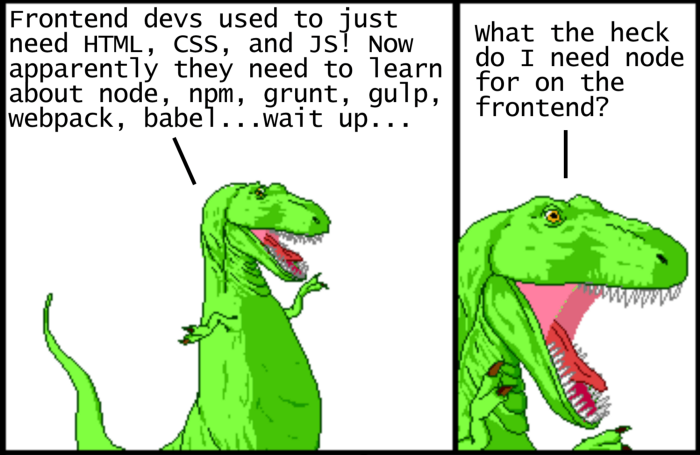

# dinosaur-js

> This repository is practice following the guidelines in [Peter Jang's - JavaScript for Dinosaurs](https://medium.com/the-node-js-collection/modern-javascript-explained-for-dinosaurs-f695e9747b70) article.

## Built With

- HTML
- CSS
- JavaScript
- npm
- webpack
- moment.js

👤 **Gerónimo Morisot**

- Github: [@Bismarck-GM](https://github.com/Bismarck-GM)
- Twitter: [@Rewritablee](https://twitter.com/Rewritablee)
- Linkedin: [geronimomorisot](https://linkedin.com/in/geronimomorisot)

## 🤝 Contributing

Contributions, issues and feature requests are welcome!

Feel free to check the [issues page](issues/).

## Show your support!

Give a ⭐️ if you like this project!

## Acknowledgments

- Microverse

## 📝 License

This project is [MIT](LICENCE) licensed.
